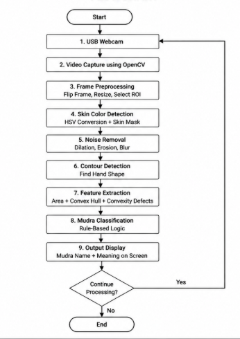

# SKILL LAB PRATICAL HACKATHON

Hand Gesture Recognition - A Computer Vision Application for Recognizing Traditional Yoga Hand Gestures TechWizards

> **Project Weight:** 100%  
> **Team Size:** 4/3 students  
> **Project Duration:** 16 hours  
> **Total Time Available:** 32 effort-hours per team  
> **Project Type:** Playful, interactive, technology-based experience

---

# 1. Team Identity

## 1.1 Tech Wizards

## 1.2 Team Members

| Name                  | Primary Role                    | Secondary Role   | Strengths Brought to the Project |
| --------------        | ------------------------------- | --------------   | -------------------------------- |
| Purva Patil (Team Leader) |System Implementation | Testing, Coding | Electronics, Logical Thinking,Software|
| Amey Padwal           | Testing, Training              | Debugging        | Hardware Handling    |
| Animish Pradhan       | Documentation                   | Github           | Documentation|
| Avdhoot Dinkar        | Literature survey               | Hardware Support        | Research Knowlegde    |

## 1.3 Project Title

Hand Gesture Recognition- A Computer Vision Application for Recognizing Traditional Yoga Hand Gestures

## 1.4 One-Line Pitch

A webcam-based Hand Gesture Recognition system that identifies various hand gestures and specifically detects different traditional Yoga Mudras along with their meanings

## 1.5 Expanded Project Idea 

Yoga Mudras are traditional hand gestures used in yoga, meditation, and wellness practices. This project uses a webcam to recognize different yoga mudras by analyzing hand shape, contour area, and finger gaps using OpenCV. The system captures live video, processes the hand region, detects the gesture, and displays the mudra name along with its meaning on the screen.
The experience created by this project is an interactive yoga learning assistant. Beginners can place their hand in front of the camera and instantly know which mudra they are performing. The project involves Python, OpenCV, webcam-based image processing, HSV skin detection, contour detection, convex hull analysis, and rule-based classification.

# 2. Inspiration

## 2.1 References

List what inspired the project.

| Source Type | Title / Link                                                        | What Inspired You|
| ----------- | ------------------------------------------------------------------- | -------------------------------------------------------------------------------------|
| Raspberry Pi   | https://www.raspberrypi.com/ | Use of low-cost embedded systems to build the project | 
| Research Paper | Real-time Recognition of Yoga Poses using computer Vision for Smart Health Care | Inspired the idea of using computer vision to detect yoga mudras and provide feedback |
|             |                                     |                                                                                           |

## 2.2 Original Twist
 
This project combines traditional yoga knowledge with modern computer vision. Instead of just detecting gestures, the system also explains the meaning of each mudra in real time. It acts as a beginner friendly learning assistant, allowing users to practice yoga mudras interactively using only a webcam. The focus on Indian cultural elements (yoga mudras) with low-cost hardware like Raspberry Pi makes it unique and practical

# 3. Project Intent

## 3.1 User Journey 

A user sits in front of the system where a Raspberry Pi is connected to a webcam and display. When the program starts, the Raspberry Pi runs the Python application and shows a live video feed on the screen with a guide box. The user places their hand inside the box and performs a yoga mudra. The Raspberry Pi captures the video through the webcam, processes each frame using OpenCV, and analyzes the hand shape.
The system identifies the mudra and displays its name along with its meaning on the screen. The Raspberry Pi acts as the main processing unit, handling image processing and decision making. The user can try different mudras and instantly learn their benefits. This creates an interactive and educational experience where low cost hardware and computer vision technology help users practice yoga correctly
                                                  

# 4. Definition of Success

## 4.1 Definition of “Usable”
The project is considered usable when a user can:
- Successfully place their hand in front of the webcam
- Get real time detection of at least 3–4 different Yoga Mudras
- See the mudra name and its meaning displayed clearly on the screen
- Use the system comfortably in normal room lighting with minimal errors

## 4.2 Minimum Usable Version

- Real time webcam input with a guide box
- Skin detection and hand contour extraction
- Recognition of minimum 3-4 Yoga Mudras
- Display of mudra name and short meaning on screen
- Basic "Unknown" gesture handling

## 4.3 Stretch Features

- Add more mudras
- Improve accuracy using Machine Learning
- Voice output 
- Add language support
- Add practice timer 
- GUI interface with buttons/menu

# 5. System Overview

## 5.1 Project Type

Check all that apply.

- [x] Electronics-based

- [ ] Mechanical

- [x] Sensor-based

- [ ] App-connected

- [ ] Motorized

- [ ] Sound-based

- [ ] Light-based

- [x] Screen/UI-based

- [ ] Fabricated structure

- [ ] Game logic based

- [ ] Installation

- [ ] Other:

## 5.2 High-Level System Description

The system is a Yoga Mudra Recognition using Hand Gestures Detection setup built using a Raspberry Pi and a USB webcam. The webcam acts as the input device, capturing live video of the user’s hand. The Raspberry Pi processes this video using Python and OpenCV. The captured frames are converted into HSV color space to detect skin regions, and contour detection is used to identify the hand shape. Based on contour area and convexity defects, the system classifies the gesture into different yoga mudras.

The output is displayed on a screen connected to the Raspberry Pi, where the detected mudra name and its meaning are shown in real time. The physical structure includes the Raspberry Pi unit, webcam, and display setup. The system does not require a mobile app, as all interaction happens directly through the screen interface, making it simple and self contained.

## 5.3 Input / Output Map

| System Part | Type | What It Does |
| -------- | -------- | -------- |
|  USB Webcam | Input	 | Captures live video of hand gestures |
|  Raspberry Pi | Processing  | Runs Python + OpenCV to process images |
|  OpenCV Software | Processing	 | Detects skin, contours, and classifies mudra |
|  Display (Monitor) | Output  | Shows video feed with detected mudra name |
|  User Hand | Input  | Performs yoga mudras |
---

# 6. System Design, Sketches and Visual Planning 

## 6.1 Concept Architecture/sketch/schemati

## 6.2 Labeled Build Sketch/architecture/flow diagram/algorithm

Add a sketch with labels showing:

- structure,
- electronics placement,
- user touch points,
- moving parts,
- output elements.

**Insert image below:**  
`[Upload image and link here]`

## 6.3 Approximate Dimensions

| Dimension        | Value   |
| ---------------- | ------- |
| Length           | `16 cm` |
| Width            | `16 cm` |
| Height           | `8 cm`  |
| Estimated weight | `400 g` |

---

# 7. Electronics Planning

## 7.1 Electronics Used

| Component                 | Quantity | Purpose                               |
| ------------------------- | --------| ------------------------------------- |
| Raspberry Pi              | 1      |    Main processing unit    |
| Camera (Webcam)           | 1      | Captures Hand gesture      |
| Display (Monitor)         | 1      | Displays Output & UI      |
| Power Adapter        | 1      | Power Supply      |

## 7.2 Wiring Plan

The USB webcam is directly connected to the Raspberry Pi via a USB port. The Raspberry Pi is powered using a standard power adapter. A display monitor is connected through HDMI to show the live camera feed and detected results. No complex wiring is required, as the system relies mainly on software processing. All components operate through simple plug-and-play connections, making the setup compact and easy to use.

## 7.3 Circuit Diagram/architecture diagram

Insert a hand-drawn or software-made circuit diagram.

**Insert image below:**  
`[Upload image and link here]`

# 7.4. Power Plan

| Question         | Response                                                                                                                                          |
| ---------------- | ------------------------------------------------------------------------------------------------------------------------------------------------- |
| Power source     | 5V DC Adapter (USB Type-C) for Raspberry Pi                                                                                                               |
| Voltage required | 5V regulated supply for Raspberry Pi and USB webcam                                                                  |
| Current concerns | High CPU usage during real-time processing may increase current draw and cause heating                                      |
| Safety concerns  | Use certified adapter, avoid overloading USB ports, ensure proper ventilation to prevent overheating |

---

# 8. Software Planning/

## 8.1 Software Tools

| Tool / Platform | Purpose                                                                           |
| --------------- | --------------------------------------------------------------------------------- |
| [Python]      | Main programming language used to write the mudra recognition code              |
| [OpenCV]      | Captures webcam video, processes frames, detects contours, and displays results |
| [NumPy]       | Supports image array operations and mask processing                             |
| [Thonny IDE]  | Used to write, run, and debug the Python program on Raspberry Pi                |

## 8.2 Software Logic/Algorithm

* *Startup behavior:*
  The Raspberry Pi starts the Python program and initializes the USB webcam using OpenCV.

* *Input handling:*
  The webcam continuously captures live video frames of the user’s hand.

* *Sensor reading:*
  The webcam acts as an image sensor and sends visual data to the Raspberry Pi.

* *Processing:*
  OpenCV flips the frame, selects a Region of Interest (ROI), converts it into HSV color space, and applies a skin-color mask.

* *Decision logic:*
  The program detects hand contours and analyzes contour area, convex hull, and convexity defects. Based on these values, it classifies the hand gesture as a yoga mudra such as Gyan Mudra, Namaste Mudra, Abhaya Mudra, or Fist Mudra.

* *Output behavior:*
  The detected mudra name and meaning are displayed on the screen in real time.

* *Communication logic:*
  No wireless communication is required. The webcam is connected directly to the Raspberry Pi through USB, and the display output is shown on the connected screen/VNC.

* *Reset behavior:*
  The program keeps updating continuously until the user presses q to exit. If no hand is detected, it displays No Hand or Unknown Mudra.

---
`

## 8.3 Code Flowchart

 

# 9. Bill of Materials

## 9.1 Full BOM

| Item                             | Quantity | In Kit? | Need to Buy? | Estimated Cost | Material / Spec               | Why This Choice?          |
| -------------------------------- | --------:| ------- | ------------ | --------------:| ----------------------------- | ------------------------- |
| `[RASPI]`                        | `1`      | `Yes`   | `No`         | `0`            | 4GB RAM board                 | Compact, low-cost device for final deployment` |
| Webcam              | `[1]`    | `No` | `Yes`       | `1000`            | 720p/1080p USB Camera                     | Easy to use, captures real-time hand gestures clearly  |

## 9.2 Material Justification

The materials and components for this project were selected based on simplicity, cost, and ease of use. A webcam is used because it is easily available and can capture real-time hand movements clearly. The software libraries OpenCV were chosen because they make image processing and hand detection much easier and faster, even for beginners. Python was used as the programming language since it is simple to understand and works well with these libraries. For the final implementation, a Raspberry Pi 4 Model B can be used because it is compact, affordable, and allows the system to run independently without a full computer. Overall, all components were selected to keep the project efficient, low-cost, and easy to implement.

## 9.3 Items You chose

| Item                 | Why Needed               | Purchase Link | Latest Safe Date to Procure | Status       |
| -------------------- | ------------------------ | ------------- | --------------------------- | ------------ |
| Ras pi  | Main Body of our Project   | NA     |NA               | NA |
| Webcam     | Captures real-time hand gestures |NA | NA           |NA |

## 9.4 Budget Summary

| Budget Item           | Estimated Cost              |
| --------------------- | ---------------------------:|
|  Webcam       |1000                     |
|Raspberry Pi 4 Model B      | 6000                     |

## 9.5 Budget Reflection

The major cost of the project comes from the Raspberry Pi and the webcam. If the overall cost needs to be reduced, the Raspberry Pi can be substituted with a personal laptop or desktop system for development and testing, as the core processing can be performed using software tools like OpenCV. Additionally, instead of purchasing a new webcam, an already available laptop camera or a shared external webcam can be used. These alternatives significantly reduce the project cost while still allowing successful implementation and testing of the system 

---

# 10. Planning the Work

## 10.1 Team Working Agreement

  
The project was divided among four team members based on responsibilities:

Member 1: Installation of OS, setup of required libraries, execution of code, and making necessary modifications.

Member 2: Development of software prototype, testing on laptop, and partial documentation work.

Member 3: Topic finalization, improvement suggestions, and research paper analysis.

Member 4: GitHub repository management, documentation updates, and debugging support.

Decisions were taken through group discussions. Final decisions were made based on feasibility, performance, and project requirements after considering suggestions from all members.

Progress was tracked regularly through:
Weekly discussions
Code execution and testing results
Updates on GitHub repository
If any task was delayed:
Work was redistributed among team members
Priority tasks were completed first
Extra time was allocated to ensure deadlines were met
Documentation was maintained and updated regularly on GitHub
Each member contributed to their respective sections
Final documentation was reviewed and refined collectively

## 10.2 Task Breakdown

| Task ID | Task                    | Owner    | Estimated Hours | Deadline     | Dependency | Status |
| ------- | ----------------------- | -------- | ---------------:| ------------ | ---------- | ------ |
| T1      |Problem Identification & Idea Finalization   | Purva | 1           | Day 1  | `None`     | `Done` |
| T2      | System Design (Architecture + Flowchart)   | Amey | 2            | Day 1  | T1     | `Done` |
| T3      | Implementation (OpenCV + MediaPipe Code)    |Avdhoot | 4             | Day1  | T2     | `Done` |
| T4      | Testing, Output & Documentation    | Animesh | 4             |Day 2  | T1     | `Not Done` |

## 10.3 Responsibility Split

| Area                 | Main Owner     | Support Owner |
| -------------------- | ----------     | ------------- |
| Electronics, Logic Thinking        | Purva  | Amey      |
|Coding & Testing         | Amey , Avdhoot          | Purva          |
| Integration    |Avdhoot           | Amey          |
| Documentation        | Animesh          |Purva        |

---

# 11 hour Milestones

### 11.1 8-hour Plan (tentatively you may set)

---

### Bi Hour 1 — Plan and De-risk

**Expected outcomes:**

- [x] Idea finalized  
- [x] Core interaction decided  
- [x] Sketches made  
- [x] BOM completed  
- [x] Purchase needs identified  
- [ ] Key uncertainty identified  
- [x] Basic feasibility tested  

---

### Bi Hour 2 — Build Subsystems

**Expected outcomes:**

- [x] Electronics tests completed  
- [ ] CAD / structure planning completed  
- [ ] App UI started if needed  
- [x] Mechanical concept tested  
- [x] Main subsystems partially working  

---

### Bi Hour 3 — Integrate

**Expected outcomes:**

- [ ] Physical body built  
- [ ] Electronics integrated  
- [ ] Code connected to hardware  
- [ ] App connected if required  
- [ ] First playable version exists  

---

### Bi Hour 4 — Refine and Finish

**Expected outcomes:**

- [ ] Technical bugs reduced  
- [ ] Playtesting completed  
- [ ] Improvements made  
- [ ] Documentation completed  
- [ ] Final build ready  

## 🔗 12.2 Update Log

| Days  | Planned Goal                                      | What Actually Happened                                      | What Changed                                      | Next Steps                                      |
|-------|--------------------------------------------------|------------------------------------------------------------|--------------------------------------------------|------------------------------------------------|
| Day 1 | Setup Raspberry Pi, install OpenCV               | Installed OS, configured webcam, tested video capture       | Faced minor camera detection issues              | Complete OpenCV setup and test preprocessing    |
| Day 2 | Implement hand detection using OpenCV            | Basic hand detection using HSV segmentation and contours    | Adjusted HSV thresholds for better accuracy      | Improve gesture recognition and reduce noise    |
# 13. Risks and Unknowns

## 13.1 Risk Register

| Risk                                                                 | Type         | Likelihood | Impact   | Mitigation Plan                                                                                  | Owner            |
|----------------------------------------------------------------------|--------------|------------|----------|--------------------------------------------------------------------------------------------------|------------------|
| Poor lighting affects hand detection accuracy                        | `Technical`  | `High`     | `High`   | Use controlled lighting, adjust HSV thresholds, apply brightness/contrast correction             | `[Your Name]`    |
| Skin color detection fails under different lighting conditions       | `Technical`  | `High`     | `High`   | Use adaptive thresholding, test under multiple lighting environments                             | `[Your Name]`    |
| Background noise interferes with hand segmentation                   | `Technical`  | `Medium`   | `High`   | Use plain background, apply filtering (blur, erosion, dilation)                                  | `[Your Name]`    |
| Incorrect gesture recognition (false positives)                      | `Technical`  | `High`     | `Medium` | Improve contour detection, convex hull analysis, fine-tune parameters                            | `[Your Name]`    |
| Webcam not detected or fails during runtime                          | `Technical`  | `Medium`   | `High`   | Check drivers, test camera beforehand, keep backup webcam                                         | `[Your Name]`    |
| Slow performance / lag on Raspberry Pi                               | `Technical`  | `Medium`   | `Medium` | Reduce frame size, optimize OpenCV processing, limit FPS                                          | `[Your Name]`    |
| Hand not properly detected due to complex background                 | `Technical`  | `Medium`   | `Medium` | Ensure simple background during demo, use ROI (Region of Interest)                                | `[Your Name]`    |
| Hardware issues (power supply, SD card failure)                      | `Hardware`   | `Low`      | `High`   | Use stable power supply, keep backup SD card                                                      | `[Your Name]`    |
| Limited number of mudras supported                                   | `Scope`      | `Low`      | `Medium` | Clearly define supported mudras (e.g., Gyan, Anjali, Chin)                                        | `[Your Name]`    |

## 13.2 Biggest Unknown Right Now

What is the single biggest uncertainty in your project at this stage?

**Response:**  
The biggest uncertainty in this project is achieving **consistent and accurate hand gesture recognition under varying real-world conditions** using only OpenCV-based techniques. Since the system relies on skin color detection, contour extraction, and convex hull analysis, its performance can be significantly affected by changes in lighting conditions, background complexity, and variations in skin tones. Ensuring that the system correctly distinguishes between similar yoga mudras without false detection remains a key challenge. Additionally, maintaining real-time performance on the Raspberry Pi while processing video frames adds to the uncertainty.
# 14. Testing 

## 14.1 Technical Testing Plan

| What Needs Testing              | How You Will Test It                                                                 | Success Condition                                                                                   |
|--------------------------------|--------------------------------------------------------------------------------------|-----------------------------------------------------------------------------------------------------|
| Webcam functionality           | Run OpenCV camera capture and display live feed                                     | Webcam opens successfully and shows continuous video stream                                         |
| Frame preprocessing            | Apply resizing, flipping, and filtering on frames                                   | Processed frames display correctly without distortion                                               |
| Hand detection (ROI)           | Place hand in front of camera and check detection area                              | Hand region is correctly identified and isolated                                                    |
| Skin color segmentation        | Test HSV thresholding under different lighting conditions                           | Skin region is consistently detected with minimal noise                                             |
| Noise removal                  | Apply blur, erosion, dilation                                                       | Background noise is reduced while keeping hand shape intact                                         |
| Contour detection              | Detect contours of hand in segmented image                                          | Largest contour corresponds to hand shape                                                           |
| Feature extraction             | Compute convex hull and convexity defects                                           | Features are correctly extracted for different hand poses                                           |
| Gesture recognition            | Show predefined mudras (Gyan, Anjali, Chin)                                         | System correctly identifies and labels gestures                                                     |
| Real-time performance          | Run full system continuously on Raspberry Pi                                        | System runs smoothly with minimal lag (acceptable FPS)                                              |
| System stability               | Run system for extended time (10–15 minutes)                                        | No crashes or major performance degradation                                                         |
## 14.2 Testing and Debugging Log

| Date           | Problem Found                                      | Type         | What You Tried                                                                 | Result               | Next Action                                      |
|----------------|---------------------------------------------------|--------------|--------------------------------------------------------------------------------|----------------------|--------------------------------------------------|
| 30th April 2026| Webcam not opening & initial hand detection failed | Technical    | Checked camera index, reinstalled drivers, adjusted HSV range                 | Partially Worked     | Fine-tune detection parameters                   |
| 2nd May 2026   | Background noise & incorrect gesture detection     | Technical    | Applied blur, erosion/dilation, improved contour & convex hull logic          | Improved             | Optimize accuracy and reduce false positives     |                   |

## 14.3 Playtesting Notes

| Tester       | What They Did                                      | What Confused Them                                      | What They Enjoyed                                      | What You Will Change                                      |
|--------------|----------------------------------------------------|----------------------------------------------------------|--------------------------------------------------------|-----------------------------------------------------------|
| `Purva`      | Tested different mudras in front of webcam         | Detection varied with lighting conditions                | Real-time gesture response                             | Improve lighting setup and adjust HSV thresholds           |
| `Amey`       | Tried Gyan and Anjali mudras repeatedly            | Similar gestures sometimes misclassified                 | Simple and intuitive interaction                       | Improve gesture classification logic                       |
| `Avadhoot`   | Tested system in different backgrounds             | Background noise affected detection                      | Instant on-screen output                               | Add better noise filtering and controlled background       |
| `Animesh`    | Tested continuous gesture input                    | Slight lag in response                                   | Smooth working after adjustments                       | Optimize processing speed and reduce frame size            |

# 15. Build Documentation

## 15.1 Fabrication Process(if any)

NA

## 16 Build Photos

Add photos throughout the project.

Suggested images:

- early sketch,
- prototype,
- electronics testing,
- mechanism test,
- app screenshot,
- final build.
- 

# 17. Final Outcome

## 17.1 Final Description

Describe the final version of your project.

**Response:**  
The final version of the project is a real-time **Yoga Mudra Hand Gesture Recognition System** implemented using a Raspberry Pi and a webcam. The system captures live video input and processes each frame using OpenCV-based image processing techniques such as skin color segmentation, contour detection, convex hull, and convexity defects to identify hand gestures.

The system is capable of recognizing predefined yoga mudras such as Gyan Mudra, Anjali Mudra, and Chin Mudra, and displays the detected gesture on the screen in real time. It has been optimized to run smoothly on the Raspberry Pi by reducing frame size and improving processing efficiency.

The final prototype works reliably under controlled lighting conditions with a simple background and demonstrates accurate gesture detection with minimal lag. This project successfully showcases the application of computer vision in health and wellness, enabling a touch-free and intuitive way to interact with systems using hand gestures. 

## 17.2 What Works Well

**Response:**  
The system performs well in real-time hand gesture detection using a webcam and Raspberry Pi, providing smooth and continuous video processing. The OpenCV-based pipeline, including skin color segmentation, contour detection, and convex hull analysis, works effectively for identifying predefined yoga mudras.

The gesture recognition is accurate under controlled lighting conditions and simple backgrounds, with minimal delay in output display. The system is easy to use, requiring only hand gestures without any additional hardware or input devices. Overall, the integration of hardware and software is stable, and the project successfully demonstrates a practical and interactive application of computer vision.

## 17.3 What Still Needs Improvement

**Response:**  
The system still requires improvement in handling varying lighting conditions and complex backgrounds, as these factors can affect the accuracy of hand detection and gesture recognition. The current implementation relies on basic image processing techniques, which may lead to false positives when gestures are similar. Additionally, the system supports only a limited number of yoga mudras, and expanding the gesture set would improve its usability. Performance optimization can also be enhanced to achieve smoother real-time processing on the Raspberry Pi with higher frame rates.

---

## 17.4 What Changed From the Original Plan

How did the project change from the initial idea?

**Response:**  
Initially, the project aimed to implement a more advanced gesture recognition system with higher accuracy and support for multiple gestures. However, due to hardware limitations and complexity, the approach was simplified to use OpenCV-based image processing techniques instead of more computationally intensive methods. The focus shifted towards achieving reliable real-time performance on the Raspberry Pi rather than implementing complex models. Additionally, the number of supported mudras was reduced to a few key gestures to ensure better accuracy and stability within the given time constraints.

# 18. Reflection

## 18.1 Team Reflection

What did your team do well?  
What slowed you down?  
How well did you manage time, tasks, and responsibilities?

**Response:**  
Our team worked effectively in dividing tasks such as hardware setup, coding, and testing, which helped us make steady progress on the project. We were able to successfully implement the core functionality of real-time hand gesture recognition using coordinated efforts. Regular testing and discussion helped us identify and fix issues quickly.

However, we faced challenges due to varying lighting conditions and inconsistencies in gesture detection, which slowed down our progress. Initial setup and debugging on the Raspberry Pi also took more time than expected.

Overall, we managed time reasonably well by following a structured plan and completing major milestones within the given timeframe. Responsibilities were shared among team members, though better planning in the early stages could have improved efficiency. Despite some delays, we were able to complete the project successfully with a working prototype.

## 18.2 Technical Reflection

What did you learn about:

- electronics,
- coding,
- mechanisms,
- fabrication,
- integration?

**Response:**  

**Electronics:**  
We learned how to interface hardware components like a webcam with the Raspberry Pi and ensure stable power supply and connectivity. We also understood practical issues such as hardware reliability and system setup.

**Coding:**  
We gained hands-on experience in Python programming using OpenCV for real-time image processing. This included frame capture, preprocessing, contour detection, and implementing logic for gesture recognition.

**Mechanisms:**  
Although the project is mostly software-based, we understood how to position the camera and hand region effectively to ensure proper detection and smooth operation.

**Fabrication:**  
We learned basic setup and arrangement of hardware components, including mounting the camera and organizing the system for a clean and functional prototype.

**Integration:**  
We understood how to combine hardware and software into a complete working system. Integrating camera input, image processing, and output display in real time on Raspberry Pi was a key learning outcome.

## 18.3 Design Reflection

What did you learn about:

- designing,
- delight,
- clarity,
- physical interaction,
- understanding,
- iteration?

**Response:**  

**Designing:**  
We learned the importance of creating a simple and effective system design where both hardware and software work seamlessly. A clear pipeline from input (camera) to output (gesture display) was essential.

**Delight:**  
We realized that real-time gesture recognition creates an engaging and satisfying user experience. Seeing immediate results on the screen made the system intuitive and enjoyable to use.

**Clarity:**  
Clear visual feedback is important. Displaying the detected mudra name on screen helped users understand whether their gesture was recognized correctly.

**Physical Interaction:**  
We understood how users interact physically with the system through hand gestures. Proper hand positioning, distance from the camera, and movement play a key role in accurate detection.

**Understanding:**  
We gained insight into how users behave while using the system and the challenges they face, such as maintaining correct hand posture and dealing with environmental conditions.

**Iteration:**  
We learned that continuous testing and improvement are crucial. By repeatedly adjusting parameters (like HSV values and filtering), we improved detection accuracy and system performance over time.

## 18.4 If You Had One More hour

What would you improve next?

To maximize the project's impact, we could integrate a multithreaded multimodal feedback layer that uses temporal thresholding to provide real-time auditory instruction without lagging the video feed. By requiring a stable gesture for a 60-frame window, the system triggers an asynchronous Text-to-Speech (TTS) engine to announce the Mudra's benefits, transforming the classifier into a low-latency assistive technology. This eyes-free interface enhances accessibility for visually impaired users and ensures the practitioner remains in a meditative state while receiving pedagogical feedback.

# 19. Final Submission Checklist

Before submission, confirm that:

- [x] Team details are complete
- [x] Project description is complete
- [x] Inspiration sources are included
- [x] Sketches are added
- [x] BOM is complete
- [x] Purchase list is complete
- [x] Budget summary is complete
- [x] Mechanical planning is documented if applicable
- [x] App planning is documented if applicable
- [x] Code flowchart is added
- [x] Task breakdown is complete
- [x] Weekly logs are updated
- [x] Risk register is complete
- [x] Testing log is updated
- [x] Playtesting notes are included
- [x] Build photos are included
- [x] Final reflection is written

---

---

